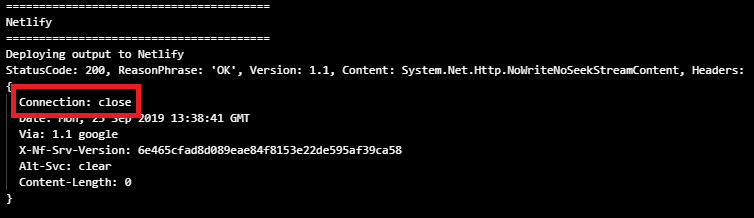

I've been migrating this blog from OctoPress to Wyam the other day. In general, it's a pretty straight-forward process, but I faced with the situation when a combination of little things led to a strange behavior I had to fight with for almost a day. As usual, the devil is in the details, so here is a quick summary about what happened and what I ended up with.

[Wyam](https://wyam.io/) is a static content generator, which is very easy to start with, highly configurable and extensible. The documentation recommends [several platforms to deploy](https://wyam.io/docs/deployment) the final result to, including [Netlify](https://www.netlify.com/), which is very friendly to lightweight static sites.

The deployment to Netlify can be done in a number of ways, described in [Wyam docs](https://wyam.io/docs/deployment/netlify). One of those ways is to use [NetlifySharp](https://netlifysharp.netlify.com), a .NET client for the Netlify REST API, also implemented by [Dave Glick](https://daveaglick.com), the father of Wyam. Fortunately, NetlifySharp provides a handy [Cake](https://cakebuild.net/) plugin to make the goal even easier to achieve.

The sample, provided by the [official documentation](https://wyam.io/docs/deployment/netlify#use-netlifysharp), can be taken literally as is:

```csharp
Task("Netlify")
    .Does(() =>
    {
        var netlifyToken = EnvironmentVariable("NETLIFY_TOKEN");
        if(string.IsNullOrEmpty(netlifyToken))
        {
            throw new Exception("Could not get Netlify token environment variable");
        }

        // Initialize the Netlify client and then issue a REST API call to update the site
        Information("Deploying output to Netlify");
        var client = new NetlifyClient(netlifyToken);
        client.UpdateSite($"mysite.netlify.com", MakeAbsolute(Directory("./output")).FullPath).SendAsync().Wait();
    });
```

As long as Netlify's own continuous deployment options do not include Cake build system at the moment of writing this, it makes sense to delegate this work to some other CI/CD platforms out there, for example, [Azure Pipelines](https://azure.microsoft.com/ru-ru/services/devops/pipelines). It supports keeping the pipeline configuration in YAML, and thus the entire configuration falls down to just a couple of lines (stolen from [Dave's own blog](https://github.com/daveaglick/daveaglick/blob/master/azure-pipelines.yml)):

```yaml
trigger:
- master
steps:
  - script: build -target BuildServer
    env:
      NETLIFY_TOKEN: $(NETLIFY_TOKEN)
```

Okay, that's enough of a prelude, we are approaching the point of where the issue popped up. Take a closer look at the last line of the code above: `NETLIFY_TOKEN: $(NETLIFY_TOKEN)`. Basically, it's saying:
> *Take a variable called `NETLIFY_TOKEN` defined in the pipeline, and pass it to the `script` build step as a value of the `NETLIFY_TOKEN` environment variable*.

This implies that variable `NETLIFY_TOKEN` must be defined first. If you forget to do this, or make a mistake in the variable name, or provide an invalid token, you won't get any warning from Azure Pipelines, which is obviously correct behavior - the platform knows nothing about your intentions. In my case the variable was not specified, and the above YAML configuration set the environment variable to the value of the string literal `$(NETLIFY_TOKEN)`.

Sadly (and this is NOT expected), Netlify REST API won't warn you, either, in case an invalid token is provided. It will *swallow* the invalid token and do nothing. Here's a build log snippet:


The only suspicious thing here is a very small build time of the `Netlify` target. Taking into account it should send some content over HTTP, it should have taken longer.

Even though the invalid token was provided, Netlify responded with status code `200`, just with a different set of response headers:



The best quick fix I came up with was to check response headers explicitly and fail the build in case the `Connection` header contains `close` value. The modified `Netlify` target in the Cake build script looks like this:

```csharp
Task("Netlify")
    .Does(() =>
    {
        var netlifyToken = EnvironmentVariable("NETLIFY_TOKEN");
        if(string.IsNullOrEmpty(netlifyToken))
        {
            throw new Exception("Could not get Netlify token environment variable");
        }

        Information("Deploying output to Netlify");
        var client = new NetlifyClient(netlifyToken);
        client.ResponseHandler = x =>
        {
            if (x.Headers.Connection != null && x.Headers.Connection.Contains("close"))
            {
                throw new Exception("Most likely invalid Netlify token was supplied");
            }
        };
        client.UpdateSite($"mysite.netlify.com", MakeAbsolute(Directory("./output")).FullPath).SendAsync().Wait();
    });
```

Now, the situation described above will fail the build and point out a potential build problem:


When the problem is fixed and correct token is placed in the environment variable, the `Netlify` target will do its job:


As usual, there's no mystery - just a sequence of mistakes multiplied by coincidence.
