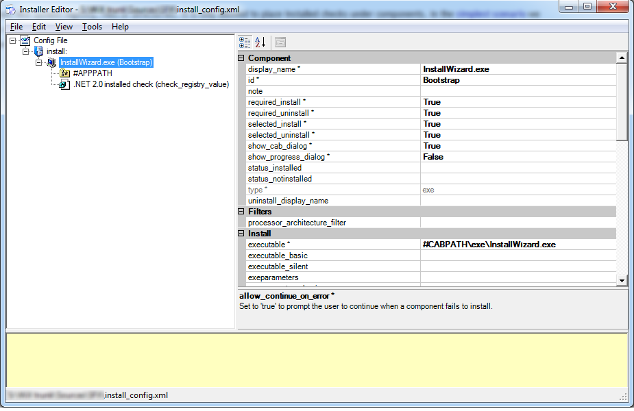
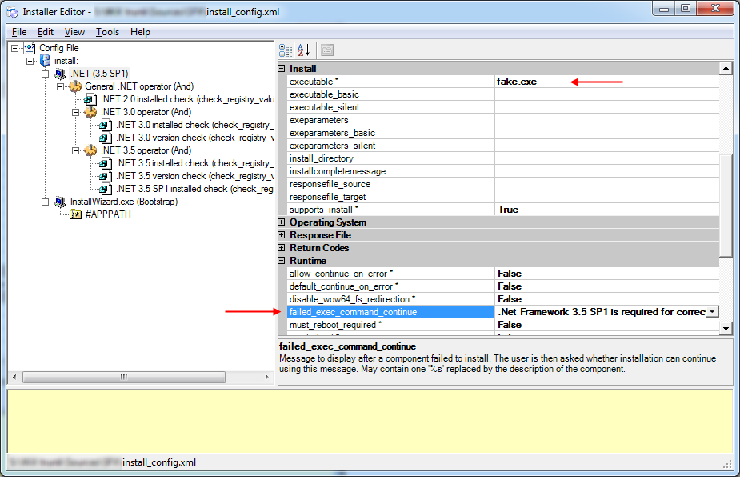

In the [previous post](./moving-to-dotnetinstaller-simplest-case) I've described how to implement the simplest use case of a bootstrapper: create a single EXE file and run the actual installation after extraction. Today I'd like to go further and illustrate more production-like situation.

Ok, imagine that you'd like to add some checks to your installation package, and run the actual installation only if all those checks pass. This scenario has its own term: adding launch conditions. Launch condition is basically a statement which evaluates to either true, or false. In case it's false, and the check is critical for the further installation, you terminate the installation process, as a rule. Otherwise, you let it do the job.

The [dotNetInstaller](http://dotnetinstaller.codeplex.com/) has a conception called Installed Checks. It can check various areas, like system registry, files or directories. It is only allowed to place installed checks under components. In the [simplest scenario](./moving-to-dotnetinstaller-simplest-case) we avoided using components, relying just on the install complete command. Components refer to separate independent parts of your installation package. There are various types of components – dotNetInstaller help file explains them all pretty good. So, my first guess was to add a single component of type `exe`, move my embedded files there and add a number of installed checks to it for various prerequisites I require. Something like this:

But my assumption was not correct. The trick is that installed check (or a combination of those) placed under a component defines **if this very component is installed**. In other words, the most *supported* use case of dotNetInstaller is when you add all the components you need into your final package, and each of them verifies its own presence on the target machine. As a result of such verification, a component decides whether to install or not.

A quick search on [codeplex.com](http://codeplex.com/) discussions gave me a link to the [appropriate feature request](http://dotnetinstaller.codeplex.com/workitem/6387), which proved my assumption it's not supported out of the box today. However, there is a workaround.

For each of the launch conditions a separate component should be declared. The trick is such components won't actually install anything, so we'll call them *fake* components. A component has a property called `failed_exec_command_continue`. It contains a message to be shown to the user in case a component failed to install, so put the appropriate message there, for instance, *.NET 3.5 SP1 is not installed. The installation program will terminate*. Make sure that both `allow_continue_on_error` and `default_continue_on_error` are set to `False` – otherwise a user will be presented with a prompt box, instead of a simple message box. Finally, put non-existing executable to the *executable* property, e.g. `fake.exe`. Now it's time to add a required number and combination of installed checks to this fake component, which will actually do the job. Here's what we get at the end of this shaman dancing:

So, how does this work? The dotNetInstaller starts the installation from the .NET (3.5 SP1) component and the first thing it evaluates the installed checks. If the evaluation succeeds, in our sample this means that the .NET 3.5 SP1 is present on the target machine. In terms of dotNetInstaller, this means that a component we called `.NET (3.5 SP1)` is installed and we do not trigger its installation. Otherwise, if the evaluation fails, this means that the component is not present and dotNetInstaller starts its installation. It will try to call `fake.exe`, which **does not exist**, and will show a message. As long as we forbad the rest of the installation to continue, it will terminate. Exactly what we need!

Note however, that the described behavior looks that good **in Basic UI mode**. The error of failed component is just logged to the log file, and no more annoying dialogs are displayed.

If you try this out, you'll notice one strange little thing with message boxes. In the next blog post I'll tell you what it is, and how to handle it. And this will be the end of the trilogy. :-)
