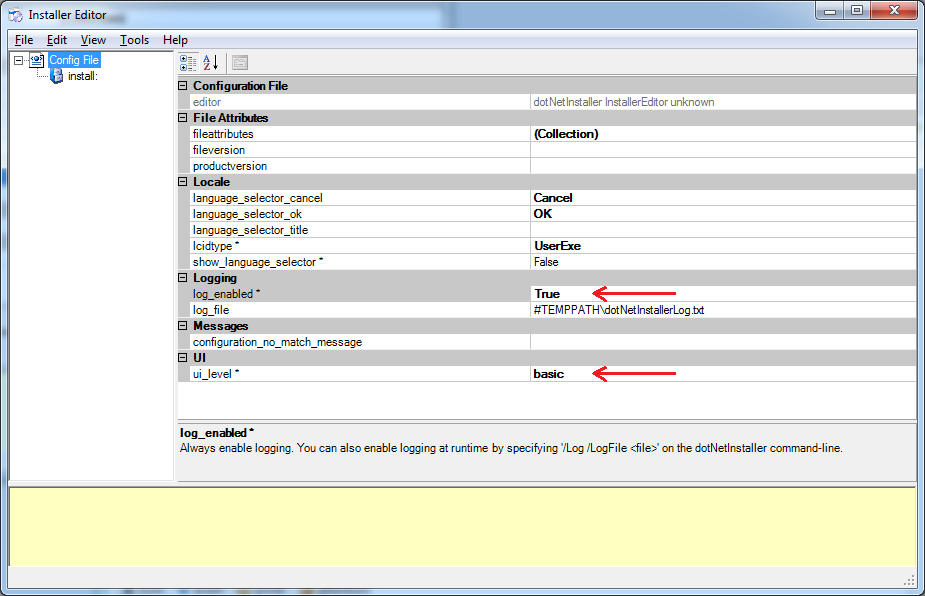
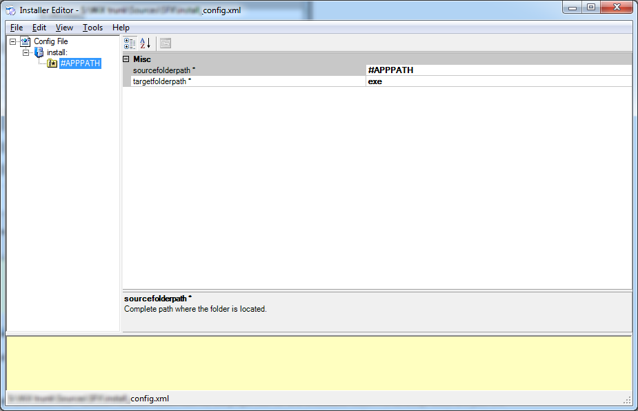
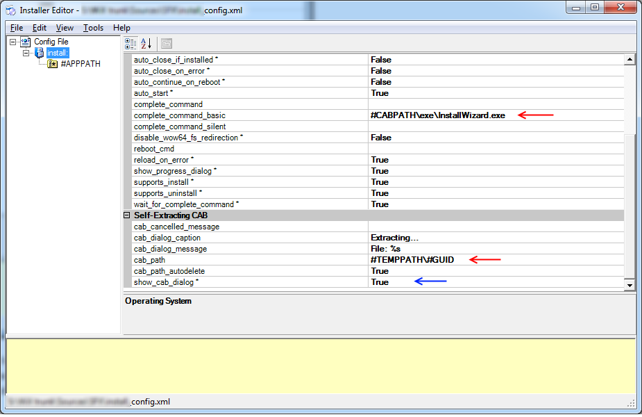
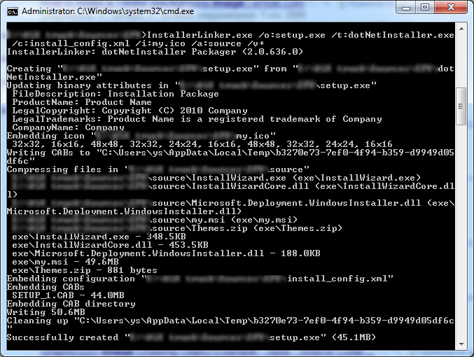

I've been playing with one of the most popular [bootstrapper](http://wix.mindcapers.com/wiki/Bootstrapper) applications available as free and open source tool – [dotNetInstaller](http://http//dotnetinstaller.codeplex.com/). On one hand, it turns out to be quite a powerful and feature-rich tool. But on the other, some things seem not intuitive to me, and there are still limitations. This post opens the series of (at least, two) posts about dotNetInstaller and my own experience with it.

Ok, imagine you need to do a very simple thing: wrap your installation program resources into a single EXE file, let it extract necessary files to somewhere under `%TEMP%`, run the installation UI wizard and finally drop extracted files when the installation is done.

You should start by installing dotNetInstaller (I used the [most recent 2.0 version](http://dotnetinstaller.codeplex.com/releases/view/50143)). One of the executables being installed is InstallerEditor.exe. It is a kind of IDE (smart editor) for dotNetInstaller project files, which are called configurations. The information about your project is stored as XML, that is easily DIFF-able and MERGE-able.

So, run InstallerEditor, and select **File** > **New** – the new empty config file will be created. The first thing I suggest to do is to enable logging – it is a property of config file you’ve just created. Next, right click the root (and so far the only) node in the left pane, and select **Add** > **Configurations** > **Setup Configuration**. Actually, this is the only type of entities you can add under config file node. Besides, at this level you can set the UI level for your bootstrapper. According to our task definition, 'basic' is just enough. By now, you should end up with something like this:



Setup configuration serves as a root for various entities: embedded files, installation components, UI controls, etc. However, our requirements for the simplest scenario doesn't require most of it. Usually configuration consists of a number of components, but again, we won’t add them for now.

In order to include installation files into our bootstrapper, right-click `install:` node and select **Add** > **Embed** > **Embed Folder**. Now fill the properties for this embedded folder. Fortunately, those are just two – `sourcefolderpath` and `targetfolderpath`. Place the value `#APPPATH` to the first one and any value to the second. `#APPPATH` is one of the several variable substitutions offered by dotNetInstaller out-of-the-box and basically means that installation files will be picked either from the current folder, or from the one you specify in the `/a` switch of the linker. The `targetfolderpath` can logically be left empty, because it sets the name of the subfolder under system temp location to extracts the files to. But it is designed to be required, so feel free to paste anything here, for instance, `exe`. Ok, so now we are at this point:



The installation wizard to run is also among those files we embedded, of course. So, in order to run it after the extraction is done we should fill in the `complete_command` property of the configuration. For this, select `install:` node and find the set of properties prefixed with `complete_command`. As you can see, the configuration entity has lots of properties to configure and is quite flexible. The `complete_command` should store the command line to run on successful installation complete. You can specify different values for each of 3 UI modes: `full`, `basic` and `silent`. Actually, if `basic` or `silent` are not specified, it will fall back to just `complete_command`.

Besides, we'd like to show CAB extraction dialog. This is especially useful when the files are large and it takes some time to extract. Set `show_cab_dialog` to `true`. Optionally, customize other properties of the CAB extraction dialog, like `Caption` and `Message`. So, summarizing these two paragraphs, we now have the following configuration:



Pay attention to `cab_path` property. In this form it basically means: take system `%TEMP%` location, and create a subfolder in it named as random GUID. This guaranties the uniqueness of the extract target location and you would not probably ever want to change it. Now, this magic location can be referenced as `#CABPATH` by other properties. For isntance, this is what we have done for `complete_command`. The values says: go to the folder the files were just extracted to, go down to its `exe` subfolder (remember `targetfolderpath`?) and run `InstallWizard.exe`.

And finally, some more details. Make sure `auto_start`, `wait_for_complete_command` and `cab_path_autodelete` are all set to `true`. Obviously, this will instruct our bootstrapper to start automatically, and auto delete the extracted files after the complete command completes.

## Linking and running

Before building the project, you can run it with dotNetInstaller.exe to see the UI. Just run `dotNetInstaller.exe /ConfigFile configuration.xml`. But <span style="color:red">**this won't embed any files**</span>. As a result, <span style="color:red">**you'll be able to check only UI**</span> (which is obviously not the point for our case). <span style="color:red">**All settings which rely on embedded files will fail.**</span>

Instead, we'll link the sources into final `setup.exe`. The following command does the job:

```BAT
InstallerLinker.exe /o:setup.exe /t:dotNetInstaller.exe /c:install_config.xml /i:my.ico /a:source /v+
```

Here, `/o:` stands for output file name, `/t:` is a template of EXE file to make like – be sure to always set it to dotNetInstaller.exe, `/c:` is a path to the configuration file we have been editing all this time, `/i:` is obviously a path to the icon to use as an application icon for setup.exe, `/a:` is a path to the installation files to embed, and finally, `/v+` turns the verbose logging on. In case there are no errors, you'll see the following output:



Now you have setup.exe, which extracts your installation files (showing the progress), and starts your main InstallWizard.exe in case of successful extraction.

That's it! As usual, your comments and notes are welcome.
