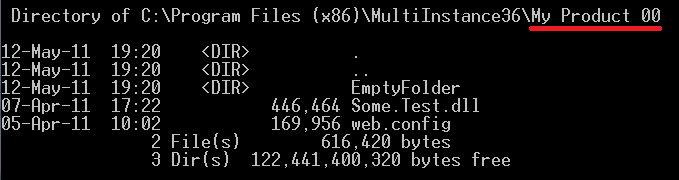
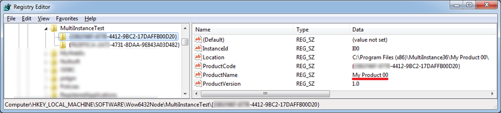
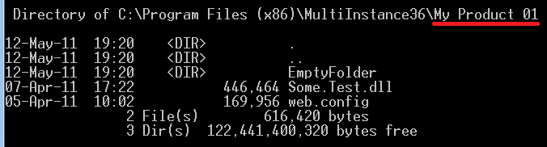
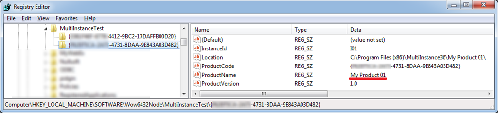
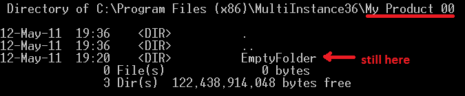
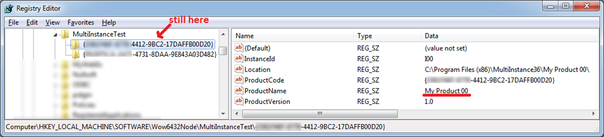

I initially [blogged about multiple instance installations](./multiple-instance-installations-and-patches) couple of years ago. The way I described it worked fine for me, but the time flies and the things has changed ever since – WiX grew up to even more solid toolset, and I also gained some knowledge. So, this post is to revisit the topic and look at it through the prism of WiX 3.6.

Imagine you have an application, and you'd like to be able to install several instances of it side-by-side on a single machine. The starting point is still to author the [`InstanceTransforms`](http://wix.sourceforge.net/manual-wix3/wix_xsd_instancetransforms.htm) element:

```XML
<InstanceTransforms Property="INSTANCEID">
   <Instance Id="I01" ProductCode="{GUIDGOES-HERE-4731-8DAA-9E843A03D482}" ProductName="My Product 01"/>
   <Instance Id="I02" ProductCode="{GUIDGOES-HERE-4f1a-9E88-874745E9224C}" ProductName="My Product 02"/>
   <Instance Id="I03" ProductCode="{GUIDGOES-HERE-5494-843B-BC07BBC022DB}" ProductName="My Product 03"/>
   ...
</InstanceTransforms>
```

Obviously, the number of `Instance` elements is the number of instances supported by this installation program (plus the default one). In order to install the default instance, you should run the following command (assuming the generated MSI package is called MultiInstance.msi):

```BAT
msiexec /i MultiInstance.msi
```

In order to start the installation of another instance, change the command as follows:

```BAT
msiexec /i MultiInstance.msi MSINEWINSTANCE=1 TRANSFORMS=":I01"
```

The [`MSINEWINSTANCE`](http://msdn.microsoft.com/en-us/library/aa370326.aspx) property set to 1 instructs msiexec to start the installation of another instance instead of default one. Note that in the above example we installing the instance `I01`. The `Instance` element results into an [instance transform](http://msdn.microsoft.com/en-us/library/aa369528.aspx) being embedded into the MSI package, and by setting [`TRANSFORMS`](http://msdn.microsoft.com/en-us/library/aa372085.aspx) property to `:I01` we instruct msiexec to apply the embedded instance transform which corresponds to the `I01` instance. The `TRANSFORMS` property can contain other transforms (for instance, language transforms), but that's another topic.

Uninstalling looks quite similar, for instance, default instance uninstallation:

```BAT
msiexec /x MultiInstance.msi
```

In order to uninstall the extra instance, you should explicitly specify its ProductCode. So, for instance `I01` the uninstall command line looks like this:

```BAT
msiexec /x {GUIDGOES-HERE-4731-8DAA-9E843A03D482}
```

So far, so good – it is quite straight-forward. Now, let’s turn to the [Windows Installer documentation about multiple instances](http://msdn.microsoft.com/en-us/library/aa367797.aspx) one more time. Apart from the requirement for each instance to have a unique product code and instance identifier (this is what WiX does for free with `InstanceTransforms` technique), it strongly recommends to keep the data isolated. For the file data, this means installing the files of each instance to a different location – the path containing instance ID as its part fits best. For the non-file data, it’s a bit more complex: the appropriate components should have different GUIDs, and again install to a different location.

In [my first attempt to approach the problem](./multiple-instance-installations-and-patches), I’ve applied a workaround: generate new GUIDs for each component of new instance, embed those *component transforms* into the resulting MSI and apply along with the instance transform. Well, sounds not very efficient, but assuming a great number of components harvested automatically, this was simple enough. Fortunately, wise developers of WiX team thought this through and came up with a far more elegant solution in version 3.6.

Starting from [WiX 3.6.1502.0](http://wix.sourceforge.net/releases/3.6.1502.0/), a [Component](http://wix.sourceforge.net/manual-wix3/wix_xsd_component.htm) element has an attribute `MultiInstance` of `YesNo` type. According to the WiX docs, *"If this attribute is set to `yes`, a new `Component/@Guid` will be generated for each instance transform.*" Fantastic! That's what we need! Let's see how it affects the multiple instance installations on a sample. Let's say our installation program consists of the following components, and we'd like to be able to install this software at least 3 times:

```XML
<Directory Id="ProductNameFolder" Name="TestName">
   <Component Id="FileComponent" Guid="{GUIDGOES-HERE-4301-95D2-86A4C80EF5F0}">
      <File Id="dll" Source="$(var.Source)\Some.Test.dll" KeyPath="yes" />
   </Component>
   <Component Id="ConfigComponent" Guid="{GUIDGOES-HERE-4c2f-BE74-CF78D2350E48}">
      <File Id="web_config" Source="$(var.Source)\web.config" KeyPath="yes" />
   </Component>
   <Directory Id="EmptyFolderDir" Name="EmptyFolder">
      <Component Id="FolderComponent" Guid="{GUIDGOES-HERE-4543-A9F8-17491670D3A6}">
         <CreateFolder />
      </Component>
   </Directory>
   <Component Id="RegistryComponent" Guid="{GUIDGOES-HERE-45e5-ABFD-07E5CC4D7BC9}">
      <RegistryKey Id="MainRegKey" Action="createAndRemoveOnUninstall" Root="HKLM" Key="SOFTWARE\MultiInstanceTest\[ProductCode]">
         <RegistryValue Id="MainRegValue" Name="InstanceId" Value="[INSTANCEID]" Type="string" />
         <RegistryValue Id="InstallPathValue" Name="Location" Value="[ProductNameFolder]" Type="string" />
         <RegistryValue Id="ProductCodeValue" Name="ProductCode" Value="[ProductCode]" Type="string" />
         <RegistryValue Id="ProductNameValue" Name="ProductName" Value="[ProductName]" Type="string" />
         <RegistryValue Id="ProductVersionValue" Name="ProductVersion" Value="[ProductVersion]" Type="string" />
      </RegistryKey>
   </Component>
</Directory>
```

```XML
<InstanceTransforms Property="INSTANCEID">
   <Instance Id="I01" ProductCode="{GUIDGOES-HERE-4731-8DAA-9E843A03D482}" ProductName="My Product 01"/>
   <Instance Id="I02" ProductCode="{GUIDGOES-HERE-4f1a-9E88-874745E9224C}" ProductName="My Product 02"/>
</InstanceTransforms>
```

The [MSDN recommendations about multiple instances](http://msdn.microsoft.com/en-us/library/aa367797.aspx) are followed, except for *keeping non-file data isolated*. Let's see how it affects the install/uninstall. Run the installation of the default and `I01` instance as described above. Both instances are installed to the different locations correctly:









Now uninstall the default instance – you’ll see that non-file data was not removed properly:





This is happening because the components which hold this data are considered shared by the Windows Installer, and during uninstallation of one instance it detects that there's another one pointing to the same components and leaves those untouched. Now if you uninstall the other instance, it successfully removes both `EmptyFolder` and registry key, but as a result we'll still have orphaned resources of the first instance.

That's the initial problem, and let's see how elegant new WiX feature deals with it. You should only add the `MultiInstance='yes'` attribute to the components holding non-file data, and forget about the problem of orphaned resources forever. Like this:

```XML
<Directory Id="ProductNameFolder" Name="TestName">
   <Component Id="FileComponent" Guid="{GUIDGOES-HERE-4301-95D2-86A4C80EF5F0}">
      <File Id="dll" Source="$(var.Source)\Some.Test.dll" KeyPath="yes" />
   </Component>
   <Component Id="ConfigComponent" Guid="{GUIDGOES-HERE-4c2f-BE74-CF78D2350E48}">
      <File Id="web_config" Source="$(var.Source)\web.config" KeyPath="yes" />
   </Component>
   <Directory Id="EmptyFolderDir" Name="EmptyFolder">
      <Component Id="FolderComponent" Guid="{GUIDGOES-HERE-4543-A9F8-17491670D3A6}" MultiInstance="yes">
         <CreateFolder />
      </Component>
   </Directory>
   <Component Id="RegistryComponent" Guid="{GUIDGOES-HERE-45e5-ABFD-07E5CC4D7BC9}" MultiInstance="yes">
      <RegistryKey Id="MainRegKey" Action="createAndRemoveOnUninstall" Root="HKLM" Key="SOFTWARE\MultiInstanceTest\[ProductCode]">
         <RegistryValue Id="MainRegValue" Name="InstanceId" Value="[INSTANCEID]" Type="string" />
         <RegistryValue Id="InstallPathValue" Name="Location" Value="[ProductNameFolder]" Type="string" />
         <RegistryValue Id="ProductCodeValue" Name="ProductCode" Value="[ProductCode]" Type="string" />
         <RegistryValue Id="ProductNameValue" Name="ProductName" Value="[ProductName]" Type="string" />
         <RegistryValue Id="ProductVersionValue" Name="ProductVersion" Value="[ProductVersion]" Type="string" />
      </RegistryKey>
   </Component>
</Directory>
```

Now check the above scenario once again: install 2 instances and uninstall them. You’ll see that both install correctly and uninstall clearly. Isn’t it GREAT?! :)

Now, let’s turn to patching. Again, if we look back to [my initial post on this topic](./multiple-instance-installations-and-patches), I was using an ugly method to make the patch applicable for all instances of the installed product. That method assumed opening the binary patch for read/write and rude injection into its structure. Though it worked, there's much more elegant way of doing this. I'd like to thank [Heath Stewart](http://blogs.msdn.com/b/heaths/) for the hint – here's the [full thread on wix-users mailing list](http://www.mail-archive.com/wix-users@lists.sourceforge.net/msg27696.html).

So, the default behavior is the following: if you author the [`PatchBaseline`](http://wix.sourceforge.net/manual-wix3/wix_xsd_patchbaseline.htm) element with its default validation settings, the patch will be applicable to the default instance only. That's because it tracks the `ProductCode` is the product baseline it was built against, and checks it during install time. The trick is to add a [Validate](http://wix.sourceforge.net/manual-wix3/wix_xsd_validate.htm) child to the `PatchBaseline`, and instruct it not to check the `ProductCode`:

```XML
<Media Id="5000" Cabinet="RTM.cab">
   <PatchBaseline Id="RTM">
      <Validate ProductId="no" />
   </PatchBaseline>
</Media>
```

So, after you build this patch, you'll be able to apply it to a particular instance:

```BAT
msiexec /i {GUIDGOES-HERE-4412-9BC2-17DAFFB00D20} PATCH=patch.msp /l*v patch.log
```

Or to all the installed instances at once (so-called *double-click scenario*):

```BAT
msiexec.exe /p patch.msp /l*vx patch.log
```

There's still one more obvious inconvenience in the patch authoring, as for me. You have to specify the `ProductCode` entries twice: in the main installation sources (`InstanceTransform/@ProductCode`) and in the patch sources (`TargetProductCode/@Id`). It would be just fantastic if during patch building the WiX tools could look into the instance transforms collection of the baseline package and take the list of product codes out of there. That would omit the necessity to always specify the following section in the patch:

```XML
<TargetProductCodes Replace="no">
    <TargetProductCode Id="{GUIDGOES-HERE-4412-9BC2-17DAFFB00D20}" />
    <TargetProductCode Id="{GUIDGOES-HERE-4731-8DAA-9E843A03D482}" />
    <TargetProductCode Id="{GUIDGOES-HERE-4f1a-9E88-874745E9224C}" />
</TargetProductCodes>
```

As usual, WiX Toolset developers have done and keep doing fantastic job making our lives as setup developers easier!

Feel free to leave a comment in case you have a note or a question. Feedback is welcome, as usual!
