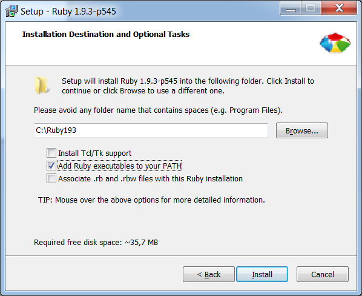

Ok, it took me some time and efforts to set up the environment for blogging. Consider this post as a quick instruction to myself for the next time I'll have to do this.

So, there's an existing blog created with [Octopress][1], hosted on [Github][2]. The task is to setup a brand new machine to enable smooth blogging experience.

> Note: just in case you have to create a blog from scratch, follow the official [Octopress docs][3], it's quite clear.

First of all, you should install Ruby. Octopress docs recommend using either rbenv or RVM for this. Both words sound scary, hence don't hesitate to take the easy path and download an installer from [here][4]. At the last page of the installation wizard, choose to add Ruby binaries to the `PATH`:



When installer completes, check the installed version:

```BAT
ruby --version
```

Then, clone the repo with the blog from Github. Instead of calling `rake setup_github_pages` as suggested by the Octopress docs, follow these steps found [here][5]. Let's assume we've done that into `blog` folder:

```BAT
git clone git@github.com:username/username.github.com.git blog
cd blog
git checkout source
mkdir _deploy
cd _deploy
git init
git remote add origin git@github.com:username/username.github.com.git
git pull origin master
cd ..
```

Now do the following:

```BAT
gem install bundler
bundle install
```

This should pull all the dependencies required for the Octopress engine. Here's where I faced with the first inconsistency in the docs - one of the dependencies (fast-stemmer) fails to install without [the DevKit][6]. Download it and run the installer. The installation process is documented [here][7], but the quickest way is:

- self-extract the archive
- `cd` to that folder
- run `ruby dk.rb init`
- then run `ruby dk.rb install`

After this, re-run the `bundle install` command.

Well, at this point you should be able to create new posts with `rake new_post[title]` command. Generate the resulting HTML with `rake generate` and preview it with `rake preview` to make sure it produces what you expect.

***An important note about syntax highlighting***

Octopress uses [Pygments][8] to highlight the code. This is a [Python][9] thing, and obviously you should install Python for this to work. Choose [2.x version of Python][10] - the 3.x version doesn't work. This is important: you won't be able to generate HTML from MARKDOWN otherwise.

That's it! Hope this will save me some time in future.

  [1]: http://octopress.org/
  [2]: https://github.com/
  [3]: http://octopress.org/docs/setup/
  [4]: http://dl.bintray.com/oneclick/rubyinstaller/rubyinstaller-1.9.3-p545.exe?direct
  [5]: http://tech.paulcz.net/2012/12/creating-a-github-pages-blog-with-octopress.html
  [6]: https://github.com/downloads/oneclick/rubyinstaller/DevKit-tdm-32-4.5.2-20111229-1559-sfx.exe
  [7]: https://github.com/oneclick/rubyinstaller/wiki/Development-Kit
  [8]: http://pygments.org/
  [9]: https://www.python.org/
  [10]: https://www.python.org/ftp/python/2.7.8/python-2.7.8.msi
