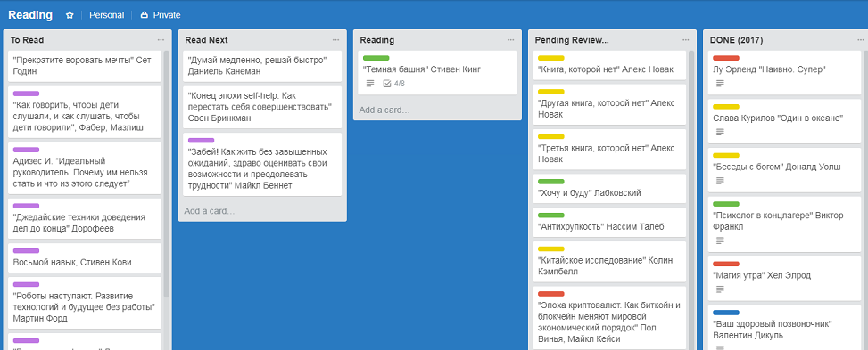
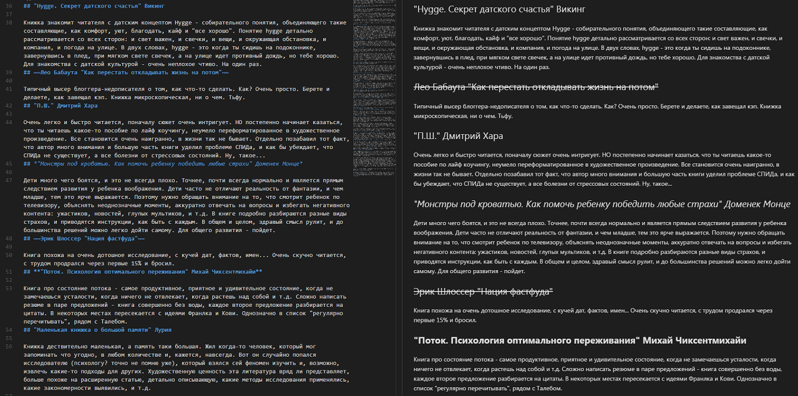

I really enjoy reading. And I think I read a lot. I'm sure there are people who read much more, but... well, that's not what I was going to tell you.

One day I realized that some book recommendations I come across got lost in my memory, so I started a special [Trello](https://trello.com) board. Basically, when I get a book recommendation from a person I respect, I add a new card to the initial *To Read* list of that board. When a certain book is read, I write a short review into the Description of the appropriate card and move it to final *Done* list.



Thus, the *Done* list gets populated with (quite subjective) book reviews. I thought it might be a good idea to post those reviews as a separate article. One day.

As long as compiling long lists out of dozens small snippets is a boring task, it turns out to be a good occasion to play with the Trello API.

So, the idea is to have a PowerShell script which will iterate over the cards in the list and generate a nice Markdown file.

## Prerequisites: app key and authorization

First of all, you should acquire the app key - the entity required for all subsequent operations. Simply head over to https://trello.com/app-key to get this API key. Let's put it into the variable.

```powershell
$apiKey = "LongSequenceOfCharsWhichIsBasicallyAnApiKey"
```

Real-world applications will need to ask each user to authorize the application, but as long as we are just playing with it locally, let's manually generate a token. Open this URL in your browser:

```URL
https://trello.com/1/authorize?expiration=never&scope=read&response_type=token&name=Server%20Token&key=<PASTE_ABOVE_KEY_HERE>
```

Note that we specify the expiration term (never) and the token scope (read only) here. Copy the token when it appears on the page and save into another variable.

```powershell
$token = "EvenLongerSequenceOfCharsWhichIsGuessWhatRightTheToken"
```

We'll need both values for any REST API request, so let's make our life easier:

```powershell
$authSuffix = "key=$apiKey&token=$token"
```

## Get the Board ID to work with

Okay, the preparations are over, and it's time to get the ID of the board we'll work with.

```powershell
$response = Invoke-RestMethod -Uri "https://api.trello.com/1/members/me?boards=open&board_fields=name&$authSuffix" -Method Get
$boardId = $response.Boards | where name -EQ "Reading" | select -ExpandProperty id
```

The URL instructs the API to get all my open boards, which is then piped through *where* filter to get the one called "Reading".

## Get the Labels used on the Board

When I finish a book, I mark it with one of the following labels:

- Green:    Recommended
- Blue:     Indifferent
- Yellow:   OK for one-time reading
- Red:      Waste of time

We'll format the subheaders of each book review depending on the label it has. For instance, recommended books will be highlighted in **bold**, while clearly not recommended will be ~~struck though~~. Let's get the list of those labels:

```powershell
$response = Invoke-RestMethod -Uri "https://api.trello.com/1/boards/$($boardId)?labels=all&label_fields=color&$authSuffix" -Method Get
$labels = $response.Labels | Convert-ArrayToHashTable
```

As a result, we have a hashtable - *LabelId : LabelColor*.

## Get the  List ID containing the Cards

Trello cards live inside the lists, so let's get the *Done* list. As long as I know that the necessary list is the last one, it's a bit easier scripted:

```powershell
$response = Invoke-RestMethod -Uri "https://api.trello.com/1/boards/$($boardId)?lists=open&list_fields=id,name&$authSuffix" -Method Get
$listId = $response.Lists | select -Last 1 -ExpandProperty id
```

## Get the Cards from the List

Now, when we have the list ID, we are just one call away from getting the collection of cards. Note that we only get necessary fields - in this case **Title** (subheader), **Label** (subheader formatting) and **Description** (actual text of the review).

```powershell
$response = Invoke-RestMethod -Uri "https://api.trello.com/1/lists/$($listId)?cards=all&card_fields=name,desc,idLabels&$authSuffix" -Method Get
$cards = $response.Cards | select @{Name="Title";       Expression={$_.name}},
                                  @{Name="Label";       Expression={$labels[$_.idLabels[0]]}},
                                  @{Name="Description"; Expression={$_.desc}}
```

## And a bit of formatting magic for dessert

Finally, the collection of cards is transformed to become a nicely formatted Markdown document:

```powershell
Convert-TableToMarkdown $cards
```

Run the script, and you'll get a markdown document, similar to this one:



## The full listing of the PowerShell script

Here is the script I ended up with, including some under-the-hood formatting magic:

```powershell
Function Convert-ArrayToHashTable
{
    begin { $hash = @{} }
    process { $hash[$_.id] = $_.color }
    end { return $hash }
}

function Get-WrapperByLabel
(
  [Parameter(Mandatory=$true)] $label
)
{
  switch ($label) {
      "red"    { "~~" }
      "green"  { "**" }
      "blue"   { "*" }
      Default { "" }
  }
}

Function Convert-TableToMarkdown
(
  [Parameter(Mandatory=$true)] $books
)
{
  $filePath = "$PSScriptRoot\result.md"
  foreach ($book in $books) {
    $wrapper = Get-WrapperByLabel $book.Label
    "## $wrapper$($book.Title)$wrapper" | Out-File -FilePath $filePath -Encoding unicode -Append
    "" | Out-File -FilePath $filePath -Encoding unicode -Append
    "$($book.Description)" | Out-File -FilePath $filePath -Encoding unicode -Append
  }
}

# Head over to https://trello.com/app-key to get this API key
$apiKey = "LongSequenceOfCharsWhichIsBasicallyAnApiKey"

# Use this shortcut for local test code: https://trello.com/1/authorize?expiration=never&scope=read&response_type=token&name=Server%20Token&key=<PASTE_ABOVE_KEY_HERE>
$token = "EvenLongerSequenceOfCharsWhichIsGuessWhatRightTheToken"

# shape the authentication suffix to append to each URI in REST calls
$authSuffix = "key=$apiKey&token=$token"

# get the ID of the target board
$response = Invoke-RestMethod -Uri "https://api.trello.com/1/members/me?boards=open&board_fields=name&$authSuffix" -Method Get
$boardId = $response.Boards | where name -EQ "Reading" | select -ExpandProperty id

# get the labels used on the board
$response = Invoke-RestMethod -Uri "https://api.trello.com/1/boards/$($boardId)?labels=all&label_fields=color&$authSuffix" -Method Get
$labels = $response.Labels | Convert-ArrayToHashTable

# get the last list (which contains the items I'm done reading)
$response = Invoke-RestMethod -Uri "https://api.trello.com/1/boards/$($boardId)?lists=open&list_fields=id,name&$authSuffix" -Method Get
$listId = $response.Lists | select -Last 1 -ExpandProperty id

# get the list of cards (necessary fields only)
$response = Invoke-RestMethod -Uri "https://api.trello.com/1/lists/$($listId)?cards=all&card_fields=name,desc,idLabels&$authSuffix" -Method Get
$cards = $response.Cards | select @{Name="Title";       Expression={$_.name}},
                                  @{Name="Label";       Expression={$labels[$_.idLabels[0]]}},
                                  @{Name="Description"; Expression={$_.desc}}

Convert-TableToMarkdown $cards
```

P.S. The [Trello](https://trello.com) REST API is clear, concise and well-documented [here](https://developers.trello.com/reference). Great job!