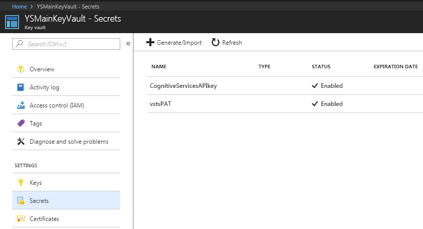
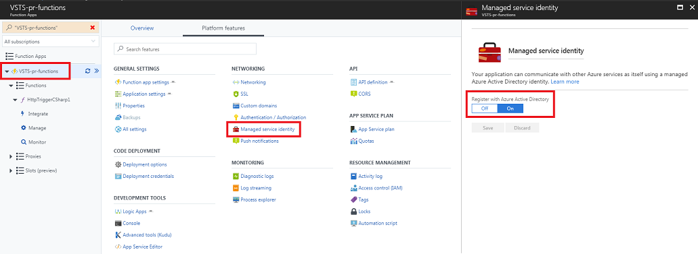
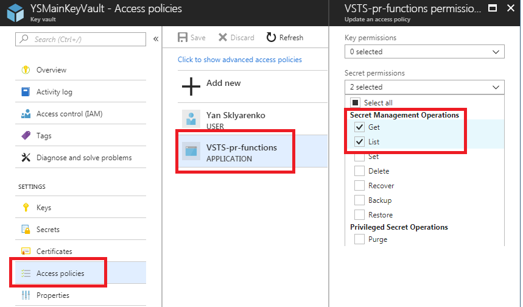
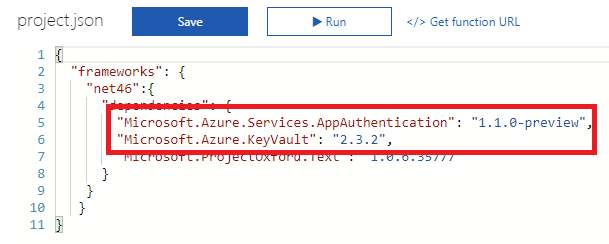
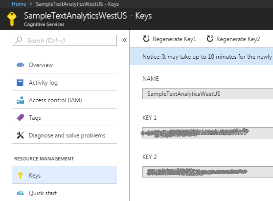
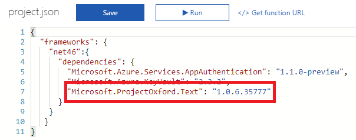
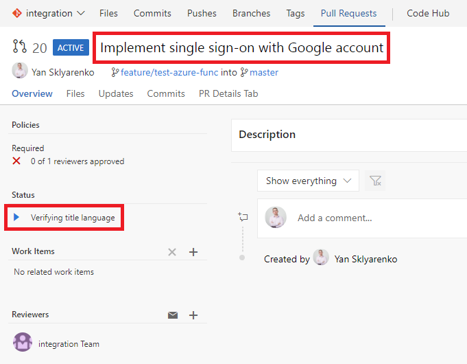
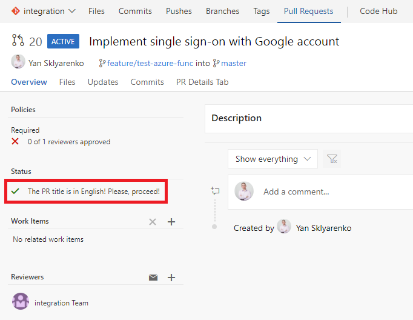
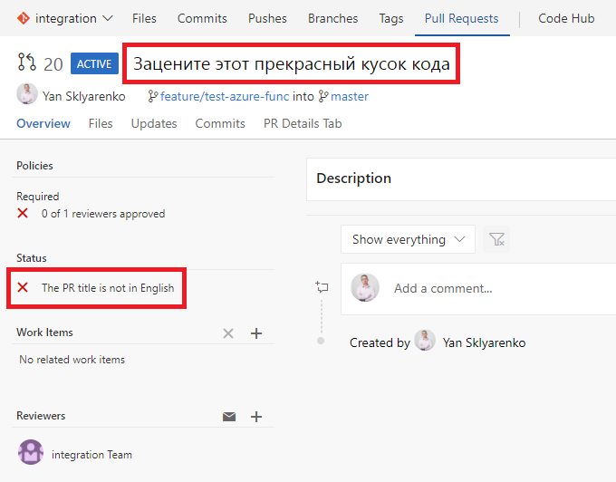
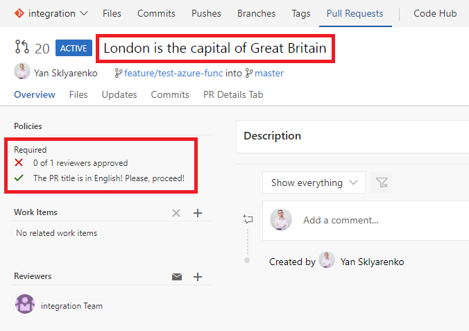

Imagine a situation when an international distributed team works on a project. People speak different languages and often tend to add comments or name things in their native language. What if we can configure a system which analyzes the pull request contents and prevents its completion unless it is in English? Fortunately, it is possible with Microsoft cognitive services API, Azure functions and custom branch policies in VSTS. Let's walk through the process.

There is a detailed article on [how to use Azure functions to create custom branch policies](https://docs.microsoft.com/en-us/vsts/git/how-to/create-pr-status-server-with-azure-functions). I will use it as a starting point.

First of all, let's remove some simplifications, like hard-coded VSTS PAT and later cognitive serivces API key. Those entities can be kept in the Azure key vault as secrets and safely addressed from the Azure function code.

Then, let's replace the primitive sample "starts with [WIP]" check in that sample above with some more sophisticated verification. I'll use Microsoft cognitive services to detect the language of the pull request title. In case the language confidence is higher than 70% I'll assume the text is in English.

Finally, let's post proper pull request status and configure branching policy out of that status, and see how the full solution works.

## Keep code secrets in the Azure Key Vault service and access those from Azure Function

There are official docs about [how to get started with the key vault service](https://docs.microsoft.com/en-us/azure/azure-stack/user/azure-stack-kv-manage-portal). We'll need to create 2 secrets: one for VSTS personal access token (PAT) and another one for API key to be used when connecting to cognitive services. The "create a secret" section under [Manage keys and secrets](https://docs.microsoft.com/en-us/azure/azure-stack/user/azure-stack-kv-manage-portal#manage-keys-and-secrets) gives a step-by-step guideline on how to do this. Note that *Secret Identifier* field - it is required to get the secret value from inside the Azure function code.



Now we need to grant our Azure function permissions to read the secrets from the key vault. [This great article](https://medium.com/statuscode/getting-key-vault-secrets-in-azure-functions-37620fd20a0b) contains detailed steps on how to achieve this. To tell it short, there are two major points:

### Enable Managed Service Identiry for the Function App

As far as I understand, it will make the function app appear as an AD identity for Azure and it will be possible to grant permissions specifically to the function as if it is done for a normal user:



### Add an access policy in the key vault for the Azure function

This will allow the function app to read the secrets in the key vault. The access policy contains a variaty of permissions, but for this sample only *Get* and *List* under *Secret Management Operations* are required:



### Access key vault secrets from the Azure function

The API required for that reside in the following two NuGet packages, that should be added to the *project.json* file of the function:



Then the code itself it quite trivial:

```c#
using Microsoft.Azure.KeyVault;
using Microsoft.Azure.Services.AppAuthentication;
// ...

var azureServiceTokenProvider = new AzureServiceTokenProvider();
var kvClient = new KeyVaultClient(new KeyVaultClient.AuthenticationCallback(azureServiceTokenProvider.KeyVaultTokenCallback));
string vstsPAT = (await kvClient.GetSecretAsync("https://ysmainkeyvault.vault.azure.net/secrets/vstsPAT/<GUID_HERE>")).Value;
string apiKey = (await kvClient.GetSecretAsync("https://ysmainkeyvault.vault.azure.net/secrets/CognitiveServicesAPIkey/<GUID_HERE>")).Value;
```

The *<GUID_HERE>* token above should be replaced with the real Secret Identifier of each secret.

## Use Microsoft cognitive services to detect the language of the pull request title

[Microsoft cognitive services](https://azure.microsoft.com/en-us/services/cognitive-services/) is a bunch of AI-driven Azure services which can do much more than just text analytics. In this article we'll just touch the surface with language part of it. I can higly recommend the [Microsoft Cognitive Services: Text Analytics API](https://app.pluralsight.com/library/courses/microsoft-cognitive-services-text-analytics-api/table-of-contents) course on Pluralsight by [Matt Kruczek](http://twitter.com/MCKRUZ) if you want to learn some more. In fact, I'll use slightly modified example from that course in this article.

To begin with, a new resource should be instantiated in Azure: Text Analytics API. It is important to choose West US as a location here, no matter which one is closer to you. For some reason, the C# API we'll work with (from Microsoft.ProjectOxford.Text NuGet package) addresses West US API endpoint. [This StackOverflow answer](https://stackoverflow.com/a/47961098/274535) helped to understand the root cause.

Once the resource is created, make sure to get the API key (KEY 1 on the image below) and place it to the key vault:



As I mentioned above, the Microsoft.ProjectOxford.Text NuGet package is to be used to talk to the language analytics service. Let's add this NuGet package to the *project.json* of the function, too:



Finally, the code itself is placed in the private method, which is called from the main function each time we need to detect the language of the text:

```c#
private static int GetEnglishConfidence(string text, string apiKey, TraceWriter log)
{
    var document = new Document()
    {
        Id = Guid.NewGuid().ToString(),
        Text = text,
    };

    var englishConfidence = 0;

    var client = new LanguageClient(apiKey);
    var request = new LanguageRequest();
    request.Documents.Add(document);

    try
    {
        var response = client.GetLanguages(request);

        var tryEnglish = response.Documents.First().DetectedLanguages.Where(l => l.Iso639Name == "en");

        if (tryEnglish.Any())
        {
            var english = tryEnglish.First();
            englishConfidence = (int) (english.Score * 100);
        }
    }
    catch (Exception ex)
    {
        log.Info(ex.ToString());
    }

    return englishConfidence;
}
```

Note that it is all about sending proper request, and then finding out the language score of the detected languages in the response.

## Post pull request status back to VSTS pull request

The original guideline I referenced at the beginning of this article contains the code of one other helper method we are going to change: *ComputeStatus*. Our version of this method will make a call to *GetEnglishConfidence* method listed above and form proper JSON to post back to VSTS:

```c#
private static string ComputeStatus(string pullRequestTitle, string apiKey, TraceWriter log)
{
    string state = "failed";
    string description = "The PR title is not in English";

    if (GetEnglishConfidence(pullRequestTitle, apiKey, log) >= 70)
    {
        state = "succeeded";
        description = "The PR title is in English! Please, proceed!";
    }

    return JsonConvert.SerializeObject(
        new
        {
            State = state,
            Description = description,

            Context = new
            {
                Name = "AIforCI",
                Genre = "pr-azure-function-ci"
            }
        });
}
```

Besides, as long as the call to the language analytics service might take some time, we need a method to post initial Pending status:

```c#
private static string ComputeInitialStatus()
{
    string state = "pending";
    string description = "Verifying title language";

    return JsonConvert.SerializeObject(
        new
        {
            State = state,
            Description = description,

            Context = new
            {
                Name = "AIforCI",
                Genre = "pr-azure-function-ci"
            }
        });
}
```

As a result, the most interesting part of the Azure function itself will look like this:

```c#
// Post the initial status (pending) while the true one is calculated
PostStatusOnPullRequest(pullRequestId, ComputeInitialStatus(), vstsPAT);
// Post the real status based on the language analysis
PostStatusOnPullRequest(pullRequestId, ComputeStatus(pullRequestTitle, apiKey, log), vstsPAT);
```

## Demo time: let's tie it all together

I'll assume that all the steps described in the [original guideline about Azure functions and pull requests]((https://docs.microsoft.com/en-us/vsts/git/how-to/create-pr-status-server-with-azure-functions)) are completed properly. As a result, VSTS knows how to trigger our Azure function on pull request create and update events.

Let's create the first pull request and let it be titled in pure English:



As soon as the title is verified against the language analytics service, the status changes:



Now, if we try to modify the title to some Russian text, the status changes accordingly:



Finally, we can [make a policy out of the pull request status](https://docs.microsoft.com/en-us/vsts/git/how-to/pr-status-policy?view=vsts), and decide whether to block the PR completion based on the language verification result:



## Conclusion

The combination of custom branch policies in VSTS and the power of Azure functions might result in very flexible solutions, limited only by your imagination. Give it a try and tweak your gated CI to comply with your needs.

Here is the full source code of the solution:

```c#
#r "Newtonsoft.Json"

using System;
using System.Net;
using System.Net.Http;
using System.Net.Http.Headers;
using System.Text;
using Newtonsoft.Json;
using Microsoft.Azure.KeyVault;
using Microsoft.Azure.Services.AppAuthentication;
using Microsoft.ProjectOxford.Text.Core;
using Microsoft.ProjectOxford.Text.Language;

private static string accountName = "[Account Name]";   // Account name
private static string projectName = "[Project Name]";   // Project name
private static string repositoryName = "[Repo Name]";   // Repository name

public static async Task<HttpResponseMessage> Run(HttpRequestMessage req, TraceWriter log)
{
    try
    {
        log.Info("Service Hook Received.");

        // Get secrets from key vault
        var azureServiceTokenProvider = new AzureServiceTokenProvider();
        var kvClient = new KeyVaultClient(new KeyVaultClient.AuthenticationCallback(azureServiceTokenProvider.KeyVaultTokenCallback));
        string vstsPAT = (await kvClient.GetSecretAsync("https://ysmainkeyvault.vault.azure.net/secrets/vstsPAT/<GUID_HERE>")).Value;
        string apiKey = (await kvClient.GetSecretAsync("https://ysmainkeyvault.vault.azure.net/secrets/CognitiveServicesAPIkey/<GUID_HERE>")).Value;

        // Get request body
        dynamic data = await req.Content.ReadAsAsync<object>();

        log.Info("Data Received: " + data.ToString());

        // Get the pull request object from the service hooks payload
        dynamic jObject = JsonConvert.DeserializeObject(data.ToString());

        // Get the pull request id
        int pullRequestId;
        if (!Int32.TryParse(jObject.resource.pullRequestId.ToString(), out pullRequestId))
        {
            log.Info("Failed to parse the pull request id from the service hooks payload.");
        };

        // Get the pull request title
        string pullRequestTitle = jObject.resource.title;

        log.Info("Service Hook Received for PR: " + pullRequestId + " " + pullRequestTitle);

        // Post the initial status (pending) while the true one is calculated
        PostStatusOnPullRequest(pullRequestId, ComputeInitialStatus(), vstsPAT);
        // Post the real status based on the language analysis
        PostStatusOnPullRequest(pullRequestId, ComputeStatus(pullRequestTitle, apiKey, log), vstsPAT);

        return req.CreateResponse(HttpStatusCode.OK);
    }
    catch (Exception ex)
    {
        log.Info(ex.ToString());
        return req.CreateResponse(HttpStatusCode.InternalServerError);
    }
}

private static void PostStatusOnPullRequest(int pullRequestId, string status, string pat)
{
    string Url = string.Format(
        @"https://{0}.visualstudio.com/{1}/_apis/git/repositories/{2}/pullrequests/{3}/statuses?api-version=4.0-preview",
        accountName,
        projectName,
        repositoryName,
        pullRequestId);

    using (HttpClient client = new HttpClient())
    {
        client.DefaultRequestHeaders.Accept.Add(new MediaTypeWithQualityHeaderValue("application/json"));
        client.DefaultRequestHeaders.Authorization = new AuthenticationHeaderValue("Basic", Convert.ToBase64String(
                ASCIIEncoding.ASCII.GetBytes(
                string.Format("{0}:{1}", "", pat))));

        var method = new HttpMethod("POST");
        var request = new HttpRequestMessage(method, Url)
        {
            Content = new StringContent(status, Encoding.UTF8, "application/json")
        };

        using (HttpResponseMessage response = client.SendAsync(request).Result)
        {
            response.EnsureSuccessStatusCode();
        }
    }
}

private static int GetEnglishConfidence(string text, string apiKey, TraceWriter log)
{
    var document = new Document()
    {
        Id = Guid.NewGuid().ToString(),
        Text = text,
    };

    var englishConfidence = 0;

    var client = new LanguageClient(apiKey);
    var request = new LanguageRequest();
    request.Documents.Add(document);

    try
    {
        var response = client.GetLanguages(request);

        var tryEnglish = response.Documents.First().DetectedLanguages.Where(l => l.Iso639Name == "en");

        if (tryEnglish.Any())
        {
            var english = tryEnglish.First();
            englishConfidence = (int) (english.Score * 100);
        }
    }
    catch (Exception ex)
    {
        log.Info(ex.ToString());
    }

    return englishConfidence;
}


private static string ComputeInitialStatus()
{
    string state = "pending";
    string description = "Verifying title language";

    return JsonConvert.SerializeObject(
        new
        {
            State = state,
            Description = description,

            Context = new
            {
                Name = "AIforCI",
                Genre = "pr-azure-function-ci"
            }
        });
}

private static string ComputeStatus(string pullRequestTitle, string apiKey, TraceWriter log)
{
    string state = "failed";
    string description = "The PR title is not in English";

    if (GetEnglishConfidence(pullRequestTitle, apiKey, log) >= 70)
    {
        state = "succeeded";
        description = "The PR title is in English! Please, proceed!";
    }

    return JsonConvert.SerializeObject(
        new
        {
            State = state,
            Description = description,

            Context = new
            {
                Name = "AIforCI",
                Genre = "pr-azure-function-ci"
            }
        });
}
```
