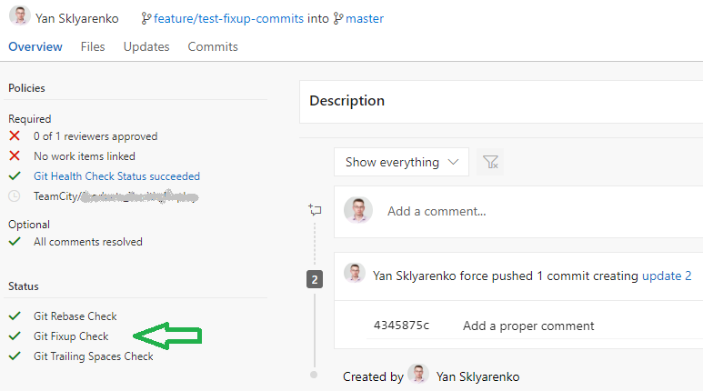

Every team of developers eventually creates a set of practices to follow regarding the repository maintenance. This includes the commit message rules, branch naming, merge strategies, etc. Some of those practices can be configured as IDE settings, for instance, automatic removal of the trailing spaces. Others, such as rebasing vs. merging, rely on the discipline and the culture in the team.

> Perhaps, the example with merging strategies is not very accurate, since [appropriate branching policies](https://devblogs.microsoft.com/devops/pull-requests-with-rebase/) have arrived to Azure Devops.

However, whenever the human factor is involved, there's always a source of unintentional errors. It would be great to automate some of the most important checks and run them in scope of the pull request verification. It can be done with a simple PowerShell script, which is triggered by a normal build definition. However, as soon as the number of checks grows, it becomes more difficult to understand which of those are violated.

For one of our projects, we've come up with a small enhancement to visualize the checks and make it easier to fix violations. The idea is to send a pull request status per each check back to the parent pull request. In case of at least one failing check the entire build should fail. There's still an option to browse for the build log and dig the actual error out. Besides, there's a handy list of statuses, visualizing the situation and helping to narrow the problem down faster.

I'll describe the basic process points on a `fixup!` and `squash!` comments presence verification.

The [Git fixup flow](https://dev.to/koffeinfrei/the-git-fixup-workflow-386d) implies that you add fixup commits and eventually run interactive rebase with `--autosquash` flag. The latter action marks the relevant commits for fixup. If you forget to add the `--autosquash` switch, you might end up with the `fixup!` commits as is in the Git history.

Here is the PowerShell code to verify the presence of `fixup!` or `squash!` commits in the range of commits brought by the pull request:

```PowerShell
$fixupStatus = "succeeded"
"fixup!", "squash!" | Foreach-Object {
    $fixups = git log $sourceCommit $targetCommit --grep="$_" --oneline
    if ($fixups.Count -ne 0) {
        Print-Error("'$_' commits detected!:`n    $([system.String]::Join(`"`n    `", $fixups))")
        $fixupStatus = "failed"
        $exitCode += 1
    }
}
Post-PullRequestStatus -name "git-fixup-status" -description "Git Fixup Check" -state $fixupStatus
```

Let's step through the key points here:

- The `$sourceCommit` and `$targetCommit` point to the HEAD of source branch and the HEAD of target branch, respectively. They are calculated based on the incoming information of the pull request - the source branch and the target branch - using the Git commands
- The `$fixupStatus` is the actual state (`succeeded` or `failed`) of the pull request status to post back
- The `$exitCode` is incremented to indicate the error in case of the check violation, but do not stop the script execution until all other checks are verified
- The `Post-PullRequestStatus` is a helper function to post the pull request status with the Azure DevOps REST API. It needs the name to uniquely identify the status, description for visualization and the actual state calculated earlier

This is how it's implemented:

```PowerShell
function Post-PullRequestStatus {
    param (
        [string]$name,
        [string]$description,
        [string]$state,
        [string]$genre = "git-health-check"
    )

    $body = @{
        state       = $state
        description = $description
        context     = @{
            name  = $name
            genre = $genre
        }
    } | ConvertTo-Json

    Send-Request -method "POST" -Body $body | Out-Null
}
```

The `$genre` parameter is used to group the statuses of the similar nature. As long as our verifications are all about Git stuff, it defaults to `git-health-check` in the code above.

> NOTE: The `Send-Request` is a helper function to wrap the details of the Azure DevOps REST API call. I won't go into the details since it's out of scope of this article.

Now, as soon as the pull request is created or updated, the build definition we called `Git Health Check Status` is triggered and, among other stuff, checks for the fixup and squash commits. In case the rule is violated, the `failed` status is sent back to the pull request and the entire build fails:


The details can be found in the normal build log of the `Git Health Check Status` build:


When the problem is fixed (that is, the branch is interactively *rebased* and *autosquashed*), the Health Check is green:



The pull request status can be prettified even further if the `targetUrl` attribute of the `body` object is supplied (see [the API specs](https://docs.microsoft.com/en-us/rest/api/azure/devops/git/pull%20request%20statuses/create?view=vsts-rest-tfs-4.1#on-iteration) for more details). For instance, the link could point to the docs explaining this particular check in detail: why keeping the `fixup!` commits out of the Git history, what Git commands one should run to resolve it, etc.

Now, with this setup in place, it is quite easy to add more checks. All you have to do is to add appropriate PowerShell snippet to perform the check and send the correct status back to the pull request.
