Some time ago VSTS team added a feature called [Pull Request Status Extensibility](https://docs.microsoft.com/en-us/vsts/release-notes/2017/aug-04-team-services#pull-request-status-extensibility-in-public-preview). It unlocked the door for the external services to post custom statuses to the pull requests created in Git repositories hosted in VSTS. Once the status is posted, it is possible to make a branching policy out of it, and this fact makes it a powerful feature.

> According to the [VSTS Feature Timeline](https://docs.microsoft.com/en-us/vsts/release-notes/index) Pull Request Status Extensibility will arrive in On-Prem TFS 2018 RC1 and future.

Fortunately, TeamCity has just added the option to send pull request statuses to its [Commit Status Publisher](https://confluence.jetbrains.com/display/TCD10/Commit+Status+Publisher) in the most recent build of the version 2017.2.

> At the moment of writing this post, the version 2017.2 is still an EAP, and I'll use [2017.2 EAP4](https://blog.jetbrains.com/teamcity/2017/11/teamcity-2017-2-eap4-is-available/) as the first build the feature has arrived with.

These two pieces assemble in a nice picture where you can host your project in VSTS while keeping the build part entirely in TeamCity. In this post, I'll guide you through the steps required to configure this beautiful setup.

## TeamCity: basic setup of the build project

To begin with, we'll add [a connection to VSTS](https://confluence.jetbrains.com/display/TCD10/Integrating+TeamCity+with+VCS+Hosting+Services#IntegratingTeamCitywithVCSHostingServices-ConnectingtoVisualStudioTeamServices) in TeamCity. It is not required, but helps a lot in the further configuration of VCS root and build features. Navigate to **Administration > &lt;Root Project&gt; > Connections** and click "Add Connection" button:

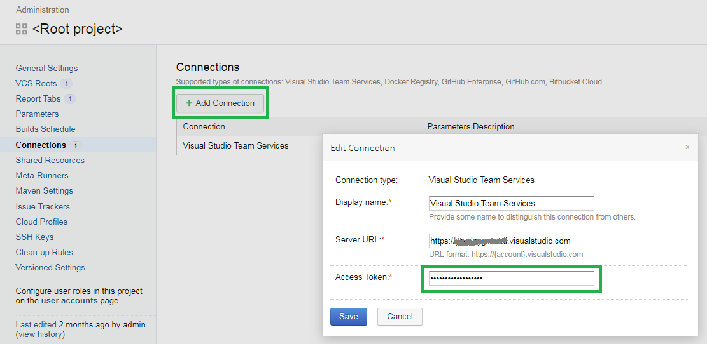

Now, let's create a new build project. Thanks to the connection configured prior to this step, the VCS root configuration is as easy as clicking a Visual Studio icon:

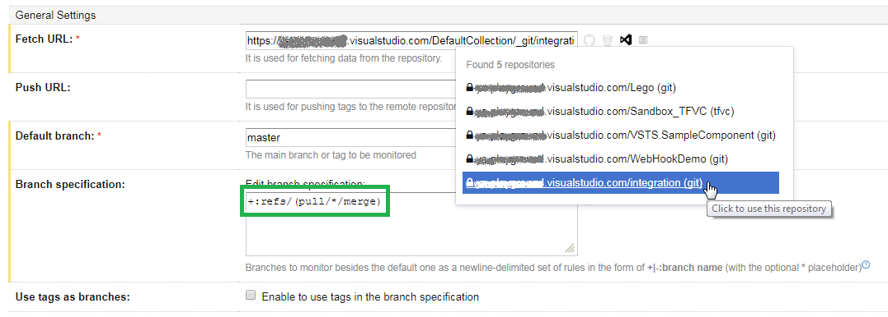

Choose the repository we'd like to target and TeamCity will form the proper clone URL. Note that Branch Specification field is set to watch pull requests too.

For the sake of this demo the build project itself is quite simple: it contains just one build configuration, which in its turn consists of a single PowerShell build step faking the real build process by several seconds sleep. There's also a VCS trigger to run the build on the changes in default branch (`+:<default>`) as well as pull request merges (`+:pull/*/merge`).

Finally, we should configure the Commit Status Publisher, which does all the magic. Switch to the Build Feature on the left pane, and click "Add Build Feature" button:

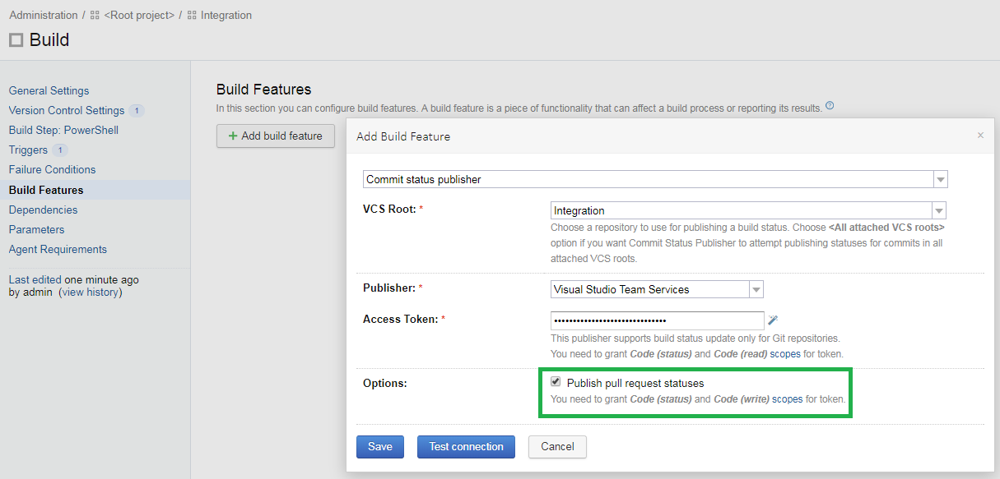

Note the checkbox that hides in the Advanced Options view. It should be turned on in order to enable pull request status publishing.

> Ideally, you should generate another personal access token in VSTS with only `Code (status)` and `Code (read)` scopes specified. However, being lazy, I've just clicked the **magic wand** icon and TeamCity pulled the **all-scopes** access token from the connection.

## VSTS: creating a pull request with status from TeamCity

Now, when we're done with TeamCity configuration, let's go ahead and create a pull request in out VSTS Git repository. When TeamCity detects the change, it starts building the pull request. At the same time, the pull request view in VSTS displays appropriate status:

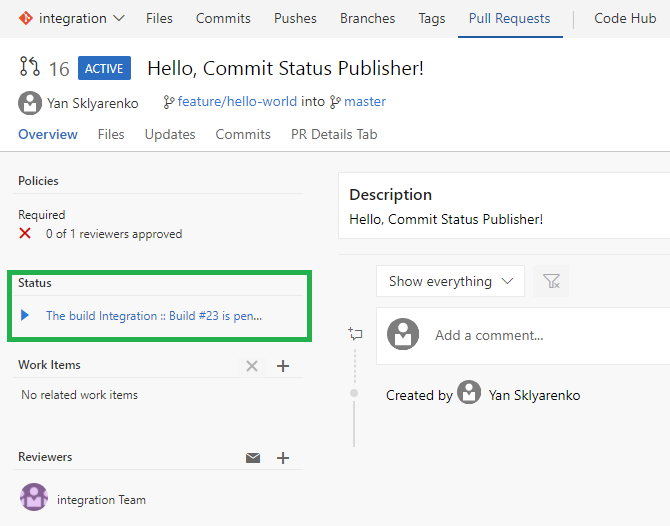

Once the build has completed, the status is refreshed:

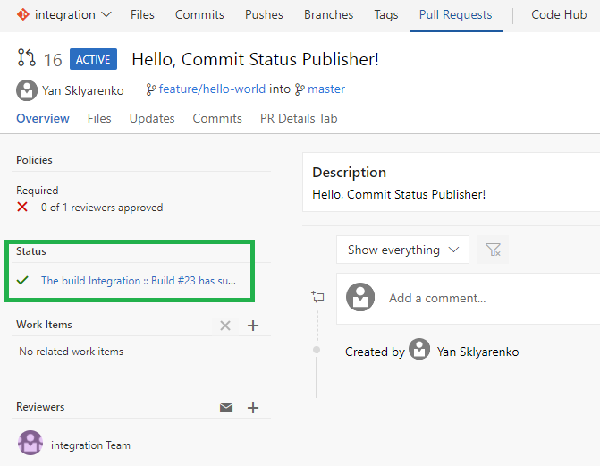

If you click the link, it navigates to the completed build page in TeamCity:

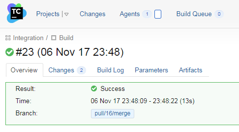

## VSTS: Make branch policy out of the TeamCity build status

As long as the external service has published its status to the pull request once, it is possible to configure it to serve as a branch policy for this and all other pull requests in this repository. Let's do this now.

Navigate to the branch policies of the `master` branch and click "Add Service" in "Require approval from external services" section:

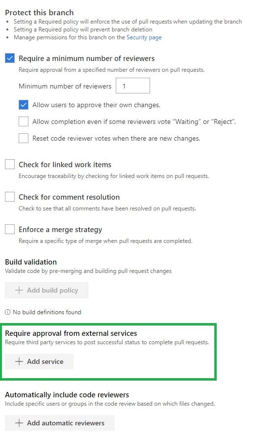

Choose the target service from the dropdown (its name is combined of TeamCity build project and configuration) and modify other options according to your needs. Note that it is possible to configure the service the way it behaves as a normal branch policy. For example, the status can be required and will expire when the source branch gets an update:

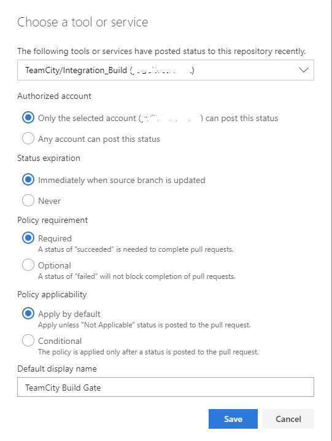

Finally, click Save and push some other change to the existing pull request. As soon as the pull request is updated, the `Status` section disappears and a new policy is displayed. It stays in the waiting mode until the TeamCity build is started:

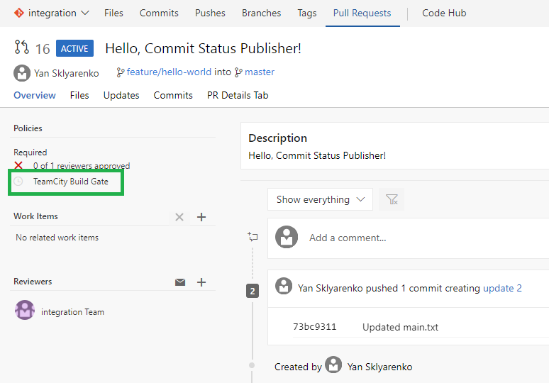

Once the build is started, the policy status changes to `Pending`:

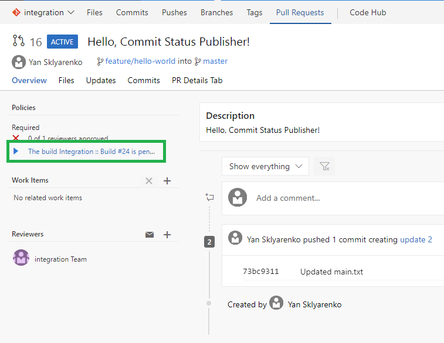

Finally, when the build is done, it is also reflected on the custom policy status:

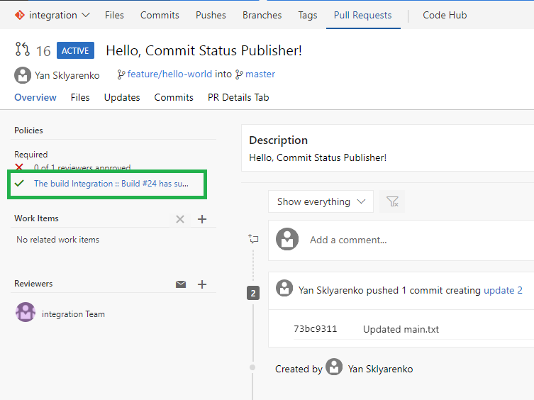

Similar to the pull request status behavior, it is possible to click the link and navigate to the build view in TeamCity.

## TeamCity: build normal branches and post the status back to VSTS

When we merge the pull request, the build of the master branch is triggered in TeamCity. If you switch to the Branches view in VSTS, you can see the `In Progress` type of icon in the Build column of the master branch:

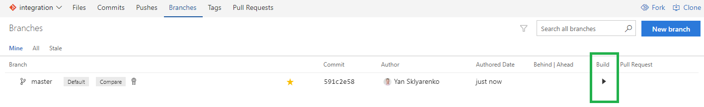

Once the build is completed, the icon changes to the appropriate state (`Success` in our case):

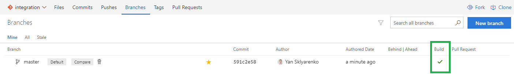

## Conclusion

In this article, we've quickly run through the steps required to configure close integration between VSTS Git repository and TeamCity build project. Note that I haven't written a single line of code for this to happen. This setup might be useful for those projects that have extensive build configuration in TeamCity, but would like to benefit from the fantastic pull request user experience in VSTS.
